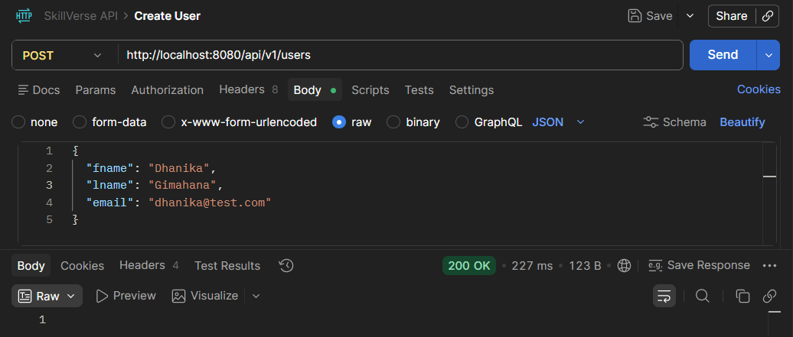
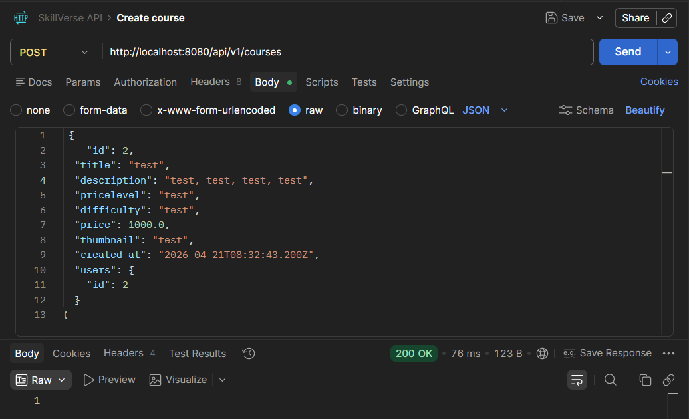
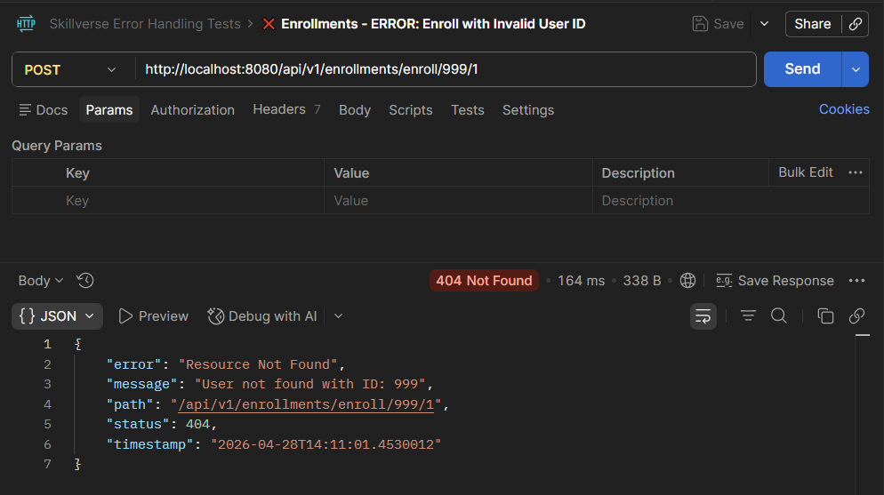
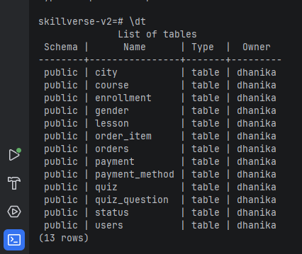
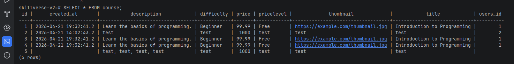
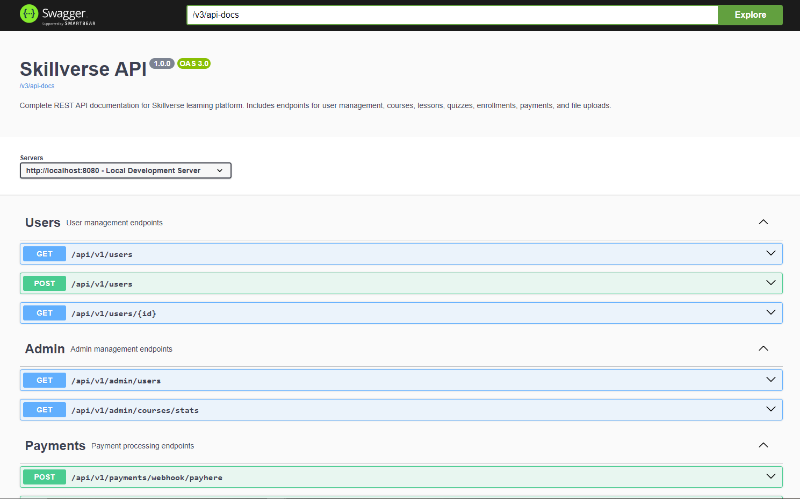

# SkillVerse 2.0

<p align="center">
  <b>RESTful backend for managing users, courses, and enrollments</b><br/>
  Clean architecture • Relational modeling • Production-ready conventions
</p>

<p align="center">
  
  
  
  
  
</p>

---

## 🚀 Overview
SkillVerse is a RESTful backend that manages **users, courses, and enrollments** featuring interactive API documentation via Swagger UI, **normalized data modeling**, and **layered architecture**.  
It demonstrates production patterns such as **idempotent endpoints**, **validation-ready DTOs**, and **clear separation of concerns**.

---

## 🧠 Architecture

```text
Client (Postman / Frontend)
        │
        ▼
Controller (HTTP layer: validation, mapping)
        │
        ▼
Service (business logic, invariants)
        │
        ▼
Repository (JPA / Hibernate)
        │
        ▼
PostgreSQL Database
```

<b>Design choices</b> 

- Controllers are thin; business rules live in services
- JPA entities model relationships (User ↔ Enrollment ↔ Course)
- Exceptions bubble to a global handler (planned/optional)
- Schema managed via ddl-auto=update (dev)

# ✨ Features
- Users API — create & retrieve users
- Courses API — create & retrieve courses
- Enrollments — link users to courses (prevents duplicates)
- REST conventions — resource-based URLs, proper HTTP methods
- Persistence — JPA/Hibernate with PostgreSQL
- Extensible — ready for validation, pagination, and auth
- Interactive API documentation using Swagger UI

# 📖 API Documentation
- Interactive API documentation is available via Swagger UI:
```text
http://localhost:8080/swagger-ui/index.html
```
- You can explore endpoints, view request/response schemas, and execute API calls directly from the browser.

# 🔌 API (sample)
```text
POST   /api/v1/users
POST   /api/v1/courses
POST   /api/v1/enrollments      # { "userId": 1, "courseId": 1 }
GET    /api/v1/users
GET    /api/v1/courses
GET    /api/v1/enrollments
```
Example: Create user
```text
curl -X POST http://localhost:8080/api/v1/users \
  -H "Content-Type: application/json" \
  -d '{"name":"Dhanika","email":"dhanika@test.com"}'
```

Example response
```text
{
  "id": 1,
  "name": "Dhanika",
  "email": "dhanika@test.com"
}
```

# ⚙️ Tech Stack
- Java 17
- Spring Boot 3.x
- Spring Data JPA (Hibernate)
- PostgreSQL
- Maven
- Postman (API testing)

# ▶️ Run Locally
1) Clone
```text
git clone https://github.com/YOUR_USERNAME/skillverse-v2.git
cd skillverse-v2
```

2) Database

Ensure PostgreSQL is running (local or Docker). Example:
```text
# src/main/resources/application.properties
spring.datasource.url=jdbc:postgresql://localhost:5332/skillverse
spring.datasource.username=postgres
spring.datasource.password=password
spring.jpa.hibernate.ddl-auto=update
spring.jpa.show-sql=true
```

3) Start app
```text
./mvnw spring-boot:run
# or: mvn spring-boot:run
```

4) Test

Use Postman or curl with the endpoints above.

### 5. Access API Documentation
- Open Swagger UI:
```text
http://localhost:8080/swagger-ui/index.html
```

# 🖼️ Screenshots

<b>Postman<b/>





<b>Database<b/>




### Swagger UI


# 🗂️ Project Structure
```text
src/main/java/com/skillverse
 ├── controller
 ├── service
 ├── repository
 └── entity
```

# 🧪 Notes on Design
- Idempotency: duplicate enrollment attempts are rejected
- Naming: resource-oriented endpoints (/users, /courses, /enrollments)
- Separation: HTTP concerns vs. business logic vs. persistence
- Extensibility: ready for DTO layer, validation, pagination

# 🗺️ Roadmap
- JWT Authentication & authorization
- Pagination & filtering (/users?page=...)
- Global exception handling (@ControllerAdvice)
- OpenAPI/Swagger docs
- Dockerized setup (app + DB)
- CI pipeline (build & tests)

<b>👤 Author<b/> - Dhanika Jagodaarachchi
